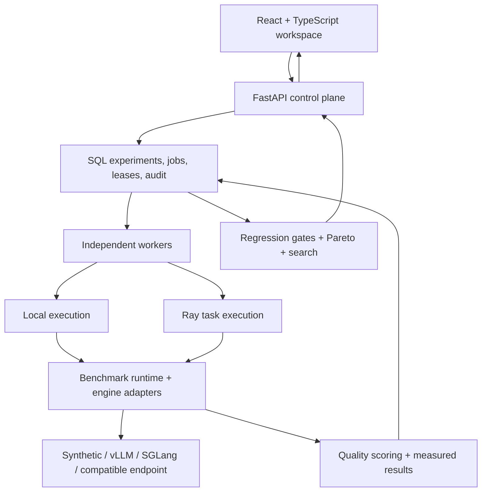

<div align="center">

# InferScale

### Measure inference. Enforce quality. Find better serving configurations.

**An end-to-end platform for reproducible LLM inference experiments, configuration optimization, and serving operations.**

[](https://github.com/Harshrudrawar/InferScale/actions/workflows/ci.yml)


[Quick start](#quick-start) · [Architecture](#architecture) · [Capabilities](#capabilities) · [Verified results](#verified-results) · [Documentation](#documentation)

</div>

---

## The project

Choosing an inference configuration means balancing latency, throughput, answer quality, memory, and cost. A faster run is only useful if its answers remain good—and a comparison is only useful if its workloads and measurements are comparable.

**InferScale brings that entire decision loop into one workspace:** register an engine, define a workload, run repeatable experiments, evaluate outputs, enforce regression policies, and search for a better configuration. A React dashboard sits on top of a FastAPI control plane, durable SQL workers, optional Ray execution, and adapters for external inference engines.

**v0.3.0 is the finished software release.** It includes the application, benchmark and optimization engines, operations tooling, deployment configuration, documentation, and automated validation. Real accelerator qualification and live cloud deployment are optional next-stage activities; they are not prerequisites for running the local project.

### At a glance

| Experience | What you can do |
| --- | --- |
| **One inference workspace** | Move between Overview, Experiments, Optimization, Models, and Infrastructure |
| **A complete experiment loop** | Submit → persist → execute → measure → score → gate → compare |
| **Decisions grounded in results** | Search configurations and recommend only candidates that were actually measured |
| **Durable execution** | Coordinate independent workers with resource leases, idempotency, cancellation, and fenced writes |
| **Inspectable evidence** | Export configuration, provenance, request measurements, quality scores, and policy outcomes |
| **Runs without a GPU** | Launch the synthetic environment locally, with seeded experiments and a working dashboard |

## Verified results

The [verified release run](https://github.com/Harshrudrawar/InferScale/actions/runs/34663646874) passed every CI job. These are executed checks, not a list of intended integrations.

| Validation | Evidence |
| --- | --- |
| Automated application tests | **38 tests passed**, plus lint and formatting checks |
| Frontend | TypeScript compilation and production build passed |
| Real browser | Chromium authenticated through the UI, submitted an experiment, observed completion, and navigated all five views |
| Responsive behavior | 390px viewport overflow check passed; desktop and mobile screenshots retained |
| Browser runtime | No uncaught JavaScript errors; API credentials absent from local/session storage |
| HTTP concurrency | **288 correct responses, zero failures**, across concurrency levels 1, 8, and 32 |
| Durable workers | Independent worker-process checks and real PostgreSQL integration passed |
| Packaged application | Docker build, HTTP/SQLite execution, and a real Python Ray task passed inside the runtime image |
| Container security | Blocking Trivy scan passed with **zero HIGH/CRITICAL vulnerability findings** and no blocking secret findings |
| Quality integration | Actual pinned OpenEval accuracy/containment/weighted integration exercised |

Browser screenshots and load reports are retained in the **`browser-load-evidence`** CI artifact. Security results are retained separately. Security findings describe the scanned image at that run, not a permanent guarantee.

> The concurrency and demo results use the synthetic backend. They establish software correctness under the tested conditions—not GPU throughput, LLM quality, or production capacity. See the [validation record](reports/VALIDATION.md) and [measurement contract](docs/METHODOLOGY.md).

## Quick start

**Requirements:** Git and Python 3.12. The launcher downloads dependencies on first use. No cloud account, GPU, or paid model API is needed for the local demo.

```bash
git clone https://github.com/Harshrudrawar/InferScale.git
cd InferScale
```

**Windows:**

```powershell
py -3.12 launch.py
```

**macOS / Linux:**

```bash
python3.12 launch.py
```

The launcher prepares an isolated environment, installs the application with search and telemetry support, seeds four synthetic benchmark configurations, starts the server, and opens the dashboard. Existing experiments remain available on subsequent launches. Keep the terminal open; **Ctrl+C** stops the server.

- **Dashboard:** [localhost:8000/ui/](http://127.0.0.1:8000/ui/)
- **Interactive API documentation:** [localhost:8000/docs](http://127.0.0.1:8000/docs)
- **Offline preview:** download [InferScale-preview.html](InferScale-preview.html) and open it in a browser. It embeds the actual dashboard bundle and recorded synthetic results; execution actions require the live application.

The bundled frontend lets you launch without a Node.js build. Node.js is needed when developing or rebuilding the dashboard. The launcher and full development installation below are separate paths: Ray and OpenEval are available in the complete dependency lock.

## Inside the workspace

| View | Workflow |
| --- | --- |
| **Overview** | Inspect recent runs, latency and throughput charts, quality signals, and experiment activity |
| **Experiments** | Configure workloads, follow queued/running/completed states, filter runs, compare selections, and export evidence |
| **Optimization** | Choose models, search strategy, trial budget, and objective; inspect study history and recommendations |
| **Models** | Inspect engine aliases, hardware metadata, admission limits, quantization, resource groups, and configured cost |
| **Infrastructure** | Inspect backend activity, circuit state, telemetry, managed deployments, and audit events |

The dashboard connects to the real API. API keys remain in memory for the session. Experiment forms support closed-loop or arrival-rate workloads, repetitions, configurable concurrency, prompts, and quality cases.

## Architecture



**The API coordinates; workers execute; SQL preserves the record.** Separate resource groups let independent hardware run concurrently while serializing experiments that share a declared resource. The same benchmark runtime supports command-line experiments and queued jobs.

For a local launch, SQLite and an embedded worker keep setup small. PostgreSQL, independent workers, and an optional prepared Ray cluster support a more distributed topology.

## Capabilities

### Reproducible inference experiments

- Streaming and nonstreaming chat/text APIs with synthetic, vLLM, SGLang, and generic OpenAI-compatible adapters.
- Closed-loop concurrency and fixed or seeded Poisson arrival schedules.
- Warmup, repeated trials, bounded admission, explicit overload records, and scheduler-lag measurements.
- P50/P95/P99 latency, time to first content, token timing where usage is available, request/token throughput, and error rate.
- Configuration, workload/dataset/source hashes, model metadata, scorer identity, package versions, and individual request measurements.

Errors stay in the attempted-request denominator. Missing usage or hardware measurements remain unavailable. The methodology defines what each number measures, including the limitations of streamed token timing and engine-wide telemetry.

### Quality-aware gates and optimization

- Built-in functional scoring and integration with [OpenEval](https://github.com/Harshrudrawar/OpenEval), pinned to a specific source commit.
- Accuracy, containment, weighted scoring, and an optional Ollama-backed judge plugin.
- Workload/scorer compatibility checks before regression comparisons.
- Grid, random, and finite-space Bayesian search using Gaussian-process expected improvement.
- Quality/latency/throughput Pareto selection and cost, memory, throughput, or latency constraints.
- Persisted search studies, trial history, feasibility decisions, and measured-candidate recommendations.

The included real-release policy requires at least **1,000 requests**, quality **≥ 0.90**, error rate **≤ 1%**, latency regression **≤ 10%**, and quality drop **≤ 0.01** where a baseline is compared. **Synthetic evidence is rejected by that policy.** A separate demo policy supports local functional examples.

### Durable jobs and failure handling

- SQL-backed experiment submission with idempotency keys and atomic resource claims.
- Renewed leases and ownership checks that prevent stale workers from overwriting results.
- Cooperative cancellation, interrupted-job handling, explicit reruns, and immutable terminal records through the API.
- Health-aware routing, circuit breakers, and opt-in nonstreaming failover with backoff.
- Fault-study tooling for transport failures, truncated streams, timeouts, and load-generator overload.

### Engine operations and observability

- Declared vLLM/SGLang process profiles for batching, context length, dtype/quantization, cache, and tensor parallelism.
- Controlled start/health/benchmark/stop lifecycles for owned engine processes.
- Prometheus metrics, optional OpenTelemetry instrumentation, and worker-host CPU/RAM/network/GPU/power collection.
- Engine phase counter deltas, quality-aware configuration comparisons, and a metrics-based autoscaling controller.
- Viewer/operator/admin access keys, body and rate limits, audit events, and additive database migration.

### Deployment and accelerator tooling

- A multistage Docker image with a Wolfi/glibc Python runtime, non-root execution, and a blocking vulnerability/secret scan.
- Compose configuration for API/dashboard, workers, PostgreSQL, Prometheus, and Grafana.
- Helm and Kubernetes configuration, optional GPU/HPA/KubeRay resources, and a Terraform Helm wrapper.
- A CUDA affine-plus-ReLU fusion experiment and a two-GPU NCCL all-reduce correctness/latency experiment.
- NeuronX fixed-shape compilation, artifact hashes/manifests, reload, and optional accelerator output verification.
- Pinned-tokenizer workload generation, scaling reports, and manual hardware qualification workflows.

The accelerator and cluster paths are implemented integration tooling. The verified release covers CPU application execution and the packaged Python Ray path; actual accelerator and live cluster results are not claimed.

## Run an experiment from the CLI

After installing the complete environment below:

```bash
# Run a reproducible workload.
inferscale benchmark configs/benchmark.json --output results/demo.json

# Compare concurrency settings against the same workload.
inferscale sweep configs/benchmark.json --concurrency 1 2 4 8 --output results/sweep.json

# Apply the functional-demo policy and inspect feasible trade-offs.
inferscale gate results/demo.json --policy configs/policy.demo.json
inferscale pareto results/sweep.json --policy configs/policy.demo.json
```

For regression checks, `inferscale gate` also accepts `--baseline`. Failed gates return a nonzero exit code, making the same policy usable in CI.

To enable OpenEval, set the scorer before starting the API and workers:

```bash
export INFERSCALE_SCORER=openeval:weighted
```

PowerShell equivalent: `$env:INFERSCALE_SCORER = "openeval:weighted"`. Accuracy, containment, and weighted scorers do not require a paid model API. The judge requires a separately configured Ollama model. See [evaluation](docs/EVALUATION.md).

## Development setup

<details>
<summary><strong>macOS / Linux — complete environment</strong></summary>

```bash
python3.12 -m venv .venv
source .venv/bin/activate
pip install -r requirements.lock
pip install --no-deps -e .
inferscale migrate
inferscale serve
```

</details>

<details>
<summary><strong>Windows PowerShell — complete environment</strong></summary>

```powershell
py -3.12 -m venv .venv
.\.venv\Scripts\python.exe -m pip install -r requirements.lock
.\.venv\Scripts\python.exe -m pip install --no-deps -e .
.\.venv\Scripts\inferscale.exe migrate
.\.venv\Scripts\inferscale.exe serve
```

</details>

The lock includes search, telemetry, Ray, and the actual OpenEval repository dependency. For API-only development, use `pip install -e .`; install optional extras as needed. Python 3.12/Linux is the CI-tested environment; a fresh Windows installation has not been separately qualified.

### Separate workers

Configure `INFERSCALE_DATABASE_URL` through your environment or secret manager for both API and workers. Set `INFERSCALE_EMBEDDED_WORKER=0` on the API, then run:

```bash
inferscale worker
```

For a prepared Ray cluster, configure `RAY_ADDRESS` and use `inferscale worker --executor ray`. Install dependencies when building the image; the packaged runtime does not support installing additional dependencies through Ray pip runtime environments.

### Container stack

```bash
docker compose up --build
```

The supplied stack binds to localhost: API/dashboard **8000**, Prometheus **9090**, and Grafana **3000**. Grafana defaults to `admin` / `local_dev_only`; set `GRAFANA_PASSWORD` before first initialization to change it. Compose credentials are for local development.

For real engines, start with [GPU setup](docs/GPU_SETUP.md). For cluster installation and secrets, use [cluster deployment](docs/CLUSTER.md). The runtime container has been executed in CI; the full Compose/cluster topology still requires validation in its deployment environment.

## Testing and evidence

```bash
pytest -q
ruff check src tests scripts
ruff format --check src tests scripts
npm ci --prefix frontend
npm run build --prefix frontend
python scripts/smoke.py
python scripts/worker_smoke.py
python scripts/load_smoke.py

# Real-browser checks against an isolated live server.
pip install playwright==1.58.0
python -m playwright install --with-deps chromium
python scripts/browser_smoke.py
```

The browser and load checks create temporary databases and random session keys. The main CI workflow also provisions PostgreSQL, builds and executes the runtime container, tests Python Ray, and preserves scan artifacts. Hardware workflows are manual and require prepared self-hosted runners.

## Repository map

| Path | Responsibility |
| --- | --- |
| [`src/inferscale/`](src/inferscale/) | API, benchmark runtime, adapters, queue, storage, search, gates, telemetry, and CLI |
| [`frontend/`](frontend/) | React/TypeScript workspace and production dashboard assets |
| [`configs/`](configs/) | Workloads, model registries, gate policies, deployment profiles, and accelerator examples |
| [`tests/`](tests/) | Application, ownership, optimization, integration, and failure-path tests |
| [`scripts/`](scripts/) | HTTP/browser/load checks, fault studies, release gates, and evidence utilities |
| [`infrastructure/`](infrastructure/) | Helm, Kubernetes, and Terraform deployment configuration |
| [`experiments/`](experiments/) | CUDA, NCCL, and Neuron research utilities |
| [`reports/`](reports/) | Recorded validation and local experimental evidence |
| [`.github/workflows/`](.github/workflows/) | Application, container security, and manual hardware workflows |

## Documentation

| Guide | Read it for |
| --- | --- |
| [Measurement contract](docs/METHODOLOGY.md) | Timing definitions, fairness, quality, comparison rules, and provenance |
| [Evaluation](docs/EVALUATION.md) | OpenEval integration and scorer configuration |
| [Operations](docs/OPERATIONS.md) | Authentication, queue ownership, migration, telemetry, and container security |
| [GPU setup](docs/GPU_SETUP.md) | External engine hosts and managed GPU profiles |
| [Cluster deployment](docs/CLUSTER.md) | Kubernetes, workers, Ray, and scaling configuration |
| [Validation record](reports/VALIDATION.md) | Executed checks, results, and environment-specific boundaries |
| [Scope matrix](docs/ROADMAP.md) | Feature-by-feature implementation and validation coverage |
| [Environment qualification](docs/RELEASE_CHECKLIST.md) | Optional next-stage hardware and production deployment checks |

## Release scope

**The v0.3.0 application is complete and usable locally.** Its verified scope includes the dashboard, experiment lifecycle, scoring/search logic, SQL workers, real PostgreSQL integration, packaged Python Ray execution, browser workflows, and container security checks.

Future environment qualification covers real model serving on representative GPUs, CUDA/NCCL and Neuron execution, multi-node scaling, sustained production traffic, and live deployment/backup/recovery. Browser interaction checks and retained screenshots are not a full manual visual/accessibility audit. There is no hosted cloud service or published accelerator performance claim attached to this release.

---

<div align="center">

**Built by [Harsh Rudrawar](https://github.com/Harshrudrawar)**

*Reproducible experiments. Explicit quality requirements. Inspectable decisions.*

</div>
